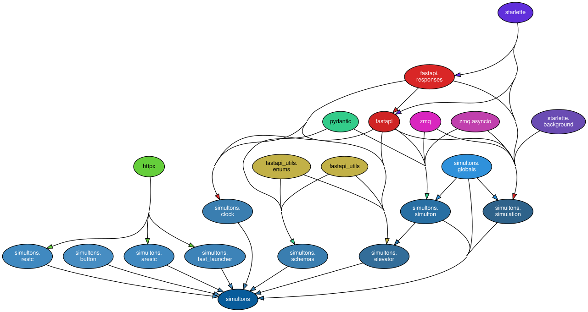

# Simultons Docs Roadmap

There is a single [simulation](simulation.md) which provides context for
[simulton](simulton.md)s.  Read ore on:

* [Architecture](architecture.md);
* [TODOs](./todo.md)

## Elevators Terminology

This started as an attempt to build an elevator simulation.

The building has multiple floors and >=1 elevator shaft(s).  Each floor has a
[floor panel](floor-panel.md) for calling an elevator.  Each elevator shaft
has a single [elevator](elevator.md).  There are [rider](rider.md)s who use
elevators by interacting first with a floor panel and then with the elevator
they ride.

## Playing with it

For now, the play is limited to running unit tests.

## Prerequisites

### ZeroMQ

Follow [documentation](https://zeromq.org/download/) to install:

For MacOS:
```sh
brew install zmq
```

For Linux:
```sh
sudo apt-get install libzmq3-dev
```

To install python library for 0mq:
```
pip install zmq
```

To verify the install:
```
> python
Python 3.10.14 (main, Mar 19 2024, 21:46:16) [Clang 15.0.0 (clang-1500.3.9.4)] on darwin
Type "help", "copyright", "credits" or "license" for more information.
>>> import zmq
>>> print(f"Current libzmq version is {zmq.zmq_version()}")
Current libzmq version is 4.3.5
>>> print(f"Current  pyzmq version is {zmq.__version__}")
Current  pyzmq version is 26.2.0
>>> exit()
```

### Python Dependencies

..are handled using virtual environment.

`pydeps fastapi` gives:



Install these using customary

```sh
pip install -r requirements.txt
```

The full list of the installed packages (get it by issuing `pip freeze`)
reveals the packages `FastAPI` and `pyzmq` rely upon:

* [anyio](https://anyio.readthedocs.io/en/stable/index.html)
* [certifi](https://github.com/certifi/python-certifi)
* [click](https://github.com/pallets/click/)
* [dnspython](https://github.com/rthalley/dnspython)
* [email_validator](https://github.com/JoshData/python-email-validator)
* [fastapi](https://github.com/FastAPI/FastAPI),
[fastapi-cli](https://github.com/fastapi/fastapi-cli),
[fastapi-utils](https://github.com/dmontagu/fastapi-utils)
* [h11](https://github.com/python-hyper/h11),
[httpcore](https://github.com/encode/httpcore),
[httptools](https://github.com/MagicStack/httptools),
[httpx](https://github.com/projectdiscovery/httpx)
* [idna](https://github.com/kjd/idna)
* [Jinja2](https://github.com/pallets/jinja/)
* [markdown-it-py](https://github.com/executablebooks/markdown-it-py)
* [MarkupSafe](https://github.com/pallets/markupsafe/)
* [mdurl](https://github.com/executablebooks/mdurl)
* [psutil](https://github.com/giampaolo/psutil)
* [pydantic_core](https://github.com/pydantic/pydantic-core),
[pydantic](https://github.com/pydantic/pydantic)
* [Pygments](https://github.com/pygments/pygments)
* [python-dotenv](https://github.com/theskumar/python-dotenv)
* [python-multipart](https://github.com/Kludex/python-multipart)
* [PyYAML](https://github.com/yaml/pyyaml)
* [rich](https://github.com/Textualize/rich)
* [shellingham](https://github.com/sarugaku/shellingham)
* [sniffio](https://github.com/python-trio/sniffio)
* [starlette](https://github.com/encode/starlette)
* [stdlib-list](https://github.com/pypi/stdlib-list)
* [typer](https://github.com/fastapi/typer)
* [typing-inspect](https://github.com/ilevkivskyi/typing_inspect)
* [typing_extensions](https://github.com/python/typing_extensions)
* [uvicorn](https://github.com/encode/uvicorn)
* [uvloop](https://github.com/MagicStack/uvloop)
* [watchfiles](https://github.com/samuelcolvin/watchfiles)
* [websockets](https://github.com/python-websockets/websockets)

## Unit Tests

To run all:
```sh
make tests
```

To run unit test:
```sh
python -m unittest tests/simulation_test.py
```

to find out if fastapi is running:
```sh
ps ax|grep fastapi
```

To find out who binds port 5556:
```
sudo lsof -i4 |grep LISTEN|grep 5556
```

## How to use it

```sh
fastapi run simultons/simulation.py
```

To watch the simulton processes:

1. use `ps` to identify the pid of the shell;
2. then

```
watch -c -n 0.1  pstree -p <pid> -Ut
```
